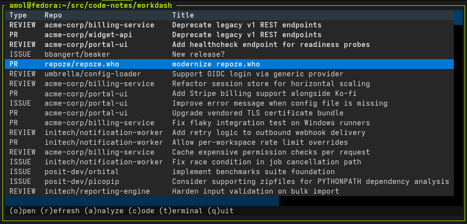

# workdash

Text-based GitHub work triage dashboard ( <https://alessandro.molina.fyi/workdash/> )

`workdash` pulls together the issues and pull requests that matter to you across
your GitHub repositories, suggests what to pick up next, and makes it easy to
jump into a work item — either for a quick review, a deeper AI-assisted
analysis, or a full coding session in a dedicated worktree.



## Platform

Linux and macOS. `workdash` relies on `xdg-open` or `open` and expects `zellij`
for the interactive dashboard and terminal-backed work actions. It has not
been tested on Windows.

## Requirements

- Python `>=3.12`.
- Authenticated [`gh`](https://cli.github.com/) for GitHub access.
  `workdash --configure` installs a local copy when `gh` is not available.
- `xdg-open` or `open` for opening links and rendered analyses in your browser.
- `zellij` for the interactive dashboard, terminal panes, and agent sessions.
  `workdash --configure` installs a local copy when `zellij` is not available.
- Global `gh` and `zellij` binaries are preferred; configured local copies are
  used as fallbacks.
- Optional, depending on which actions you use from the TUI:
  - `claude` — to analyze or launch a Claude coding session.
  - `codex` — to analyze or launch a ChatGPT Codex session.
  - `code` — to launch a VSCode + Copilot coding session.
  - `pi` — to launch a pi coding agent session.

## Installation

With [`uv`](https://docs.astral.sh/uv/) — one isolated install, `workdash` on
your `PATH`:

```bash
uv tool install workdash
```

For development install:

```bash
pip install -e '.[test]'
```

## First-time setup

On the first run you need a configuration file at
`~/.config/workdash/config.json`. Generate it interactively with:

```bash
workdash --configure
```

The wizard fills in:

- Your GitHub username.
- Zellij availability. If `zellij` is not on `PATH`, the wizard downloads the
  latest release binary into the workdash configuration directory.
- GitHub CLI availability. If `gh` is not on `PATH`, the wizard downloads the
  latest release binary into the workdash configuration directory. Authentication
  is still handled by `gh`; run `gh auth login` if startup reports that `gh` is
  not authenticated.
- The list of repositories to track (see *Repository selectors* below).
- A working directory where per-item git worktrees will live.
- The analyze and launch commands for Claude and Codex (auto-detected when the
  tools are on your `PATH`).

You can edit `~/.config/workdash/config.json` by hand at any time. Re-running
`--configure` only prompts for fields that are still empty, except for Zellij:
the wizard always checks for a global `zellij` first and downloads a fresh
local binary when no global binary exists. It does the same for `gh`, checking
for a global GitHub CLI first and downloading a fresh local copy when none is
available.

## Usage

Launch the TUI:

```bash
workdash
```

Useful commands and flags:

```bash
workdash list                # list items as plain text, no TUI
workdash list --json         # list items as machine-readable JSON
workdash info [--session NAME] [--all] [--json]  # report live Workdash-owned Zellij panes
workdash analyze ITEM [--agent NAME] [--session NAME] [--json]  # analyze a current item
workdash --refresh           # force a refresh from GitHub
workdash --debug             # verbose logging
workdash --configure         # run the interactive setup wizard
workdash --direct            # start without the automatic Zellij wrapper
workdash --version           # print version and exit
```

## What gets shown

`workdash` gathers the following for your configured GitHub username:

- Open pull requests you authored.
- Open pull requests where you are a requested reviewer, plus open pull
  requests you have already reviewed (shown as `REVIEW`).
- Open issues assigned to you.
- Open issues and pull requests across the tracked repositories.

Items are merged, deduplicated, and sorted by last update. One item is marked
with `*` as the suggested next thing to pick up.

### Repository selectors

The `repositories` list in `config.json` accepts:

- `owner/repo` — a specific repository.
- `owner/*` — every repository accessible to you under that owner.

## TUI keybindings

- `o` — open the selected item in your browser.
- `r` — refresh the list from GitHub.
- `a` — analyze the selected item. Opens a dialog to open the cached analysis
  (if any), or run a fresh analysis with Claude or Codex. Fresh analyses are
  cached and rendered as HTML in your browser.
- `c` — launch a coding session on the selected item. Opens a dialog to pick
  Claude, Codex, VSCode Copilot, or pi. `workdash` prepares a dedicated git
  worktree for the item and starts the chosen tool in it, preloaded with
  context about the issue or PR.
- `t` — open a terminal in the selected item's worktree (no agent launched).
- `q` — quit.

## Worktrees

Coding and analysis actions operate on a per-item git worktree rooted under the
configured `workdir`. Each tracked repository gets a local clone, and each work
item gets its own worktree alongside it, so you can hop between items without
disturbing other in-progress work.

## List command

`workdash list` emits one row per item, sorted by last update (most recent first):

```
TYPE   repo#TYPE-N   YYYY-MM-DD   title
```

`TYPE` is `ISSUE`, `PR`, or `REVIEW` (for review-requested PRs). The row ID is
copy/paste-friendly: `repo#ISSUE-N`, `repo#PR-N`, or `repo#REVIEW-N`. The suggested
item's title is prefixed with `* `. If nothing matches, the output is
`No work items found.`.

Use `workdash list --json` to emit the same list as JSON records with item ID,
type, kind, repository, number, title, URL, timestamps, and suggested status.

## Info command

`workdash info [--session NAME] [--json]` reports live Workdash-owned Zellij panes
for terminal-backed work actions, including pane title, cwd, command, tab, state,
and mapped Workdash item. It maps each live pane's current working directory to
the matching Workdash item ID when the pane is inside a known worktree, or reports
`unknown` when no mapping is known. Add `--all` to include other live non-plugin
panes from the selected Workdash session as `kind=unknown` with unknown item
mapping.

## Analyze command

`workdash analyze ITEM [--agent NAME] [--session NAME] [--json]` analyzes a
current Workdash item from the CLI. `ITEM` can be a row ID from `workdash list`
(such as `owner/repo#ISSUE-123`) or a GitHub issue/PR URL that is already in the
current dashboard data. The command requires an active Workdash-owned Zellij
session; pass `--session` when more than one exists. It reuses a fresh cached
analysis when available, otherwise prepares the item's worktree and runs the
selected configured analysis agent.

Human output reports the item, agent, cache status, and analysis path. `--json`
emits the same result as machine-readable JSON.

## Analysis cache

Analyses produced with `a` or `workdash analyze` are cached under
`~/.config/workdash/cache/` so that re-opening an item is instant. The cache is
keyed by the item's GitHub
`updated_at` timestamp, so any change on GitHub automatically invalidates the
cached analysis and the next analyze action will re-run it.

## Product behavior

Canonical product behavior is described in [`features/`](features/).

The `.feature` files are the source of truth for what the software does. They are product specifications first and executable BDD scenarios second.

Implementation progress can be tracked separately.
BDD is the integration point between humans and agents collaborating on the project as Workdash relied hevily on agents during its initial development cycle.

### BDD-first development (mandatory)

Every new feature **must** start with a BDD definition under [`features/`](features/), and every change to existing behavior **must** update the relevant `.feature` file **before** any implementation or test code is modified. The `.feature` files are the contract; code follows them, not the other way around.

This applies to agents and humans alike. A change that lands code without a matching `features/` update is incomplete.

## Tests

From the repository root:

```bash
PYTHONPATH=src pytest
```

### BDD suite

`tests/bdd/` drives development from the `.feature` files in `features/`.
`pytest_bdd.scenarios(...)` auto-generates one pytest test per `Scenario`,
so adding a scenario to `features/` is enough to pull it into the suite.
Step definitions live under `tests/bdd/steps/`; scenarios whose steps are
not yet implemented fail with `StepDefinitionNotFoundError`, which is the
intended TDD signal for BDD-first development.

## License

`workdash` is distributed under the terms of the GNU General Public License
version 3. See [LICENSE](LICENSE) for the full text.
